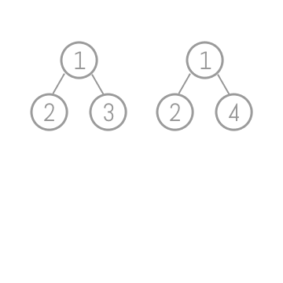

# 題目
Given two binary trees, write a function to check if they are equal or not.

Two binary trees are considered equal if they are structurally identical and the nodes have the same value.

寫一個函式，確認兩個二元樹是否相等。

節點位置跟每個值皆相等即為完全相等。


# 解題

確認兩個節點都空，代表相等。

若兩個節點都存在，比對兩個值相等，才繼續比對這兩個節點的左右兩邊。

若節點不存在或兩個節點不相等，就返回 false 。




``` swift
func isSameTree(_ p: TreeNode?, _ q: TreeNode?) -> Bool {
    if p == nil && q == nil { return true }
    
    if let p = p, let q = q, p.val == q.val {
        let c1 = isSameTree(p.left, q.left)
        let c2 = isSameTree(p.right, q.right)
        return c1 && c2
    }
    
    return false
}
```