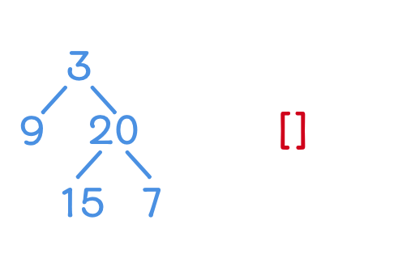

# 題目
Given a binary tree, return the bottom-up level order traversal of its nodes' values. (ie, from left to right, level by level from leaf to root).
 
給定二元樹，返回他從底部到根部的節點尋訪。 (由左到右，由層到層，從葉到根)

---

# 範例

``` swift
Given binary tree [3,9,20,null,null,15,7],

       3
      / \
     9  20
       /  \
      15   7

return its bottom-up level order traversal as:

[
   [15,7],
   [9,20],
   [3]
]
```
---

# 解題

定義一個空的二維陣列，若 level = 第一層陣列的大小，則添加一個新的陣列進去。

若到達底部節點，就將值送入對應的陣列中。




``` swift
func levelOrderBottom(_ root: TreeNode?) -> [[Int]] {
    var res = [[Int]]()

    func bfs(_ root: TreeNode?, level: Int) {
        if root == nil {
            return
        }
        if level >= res.count {
            res.insert([Int](), at: 0)
        }
        bfs(root!.left, level: level + 1)
        bfs(root!.right, level: level + 1)
        res[res.count - level - 1].append(root!.val)
    }
    
    bfs(root, level: 0)
    
    return res
}
```

