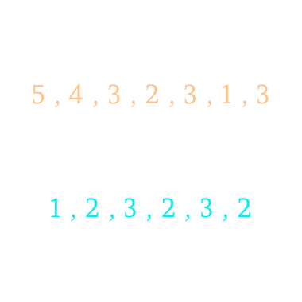

# 題目
Given two arrays, write a function to compute their intersection.
 
給定兩個陣列，求出他們的交集 (intersection)

跟上一題 [Intersection of Two Arrays](https://windsuzu.github.io/leetcode-349/) 相似，但這題需要保留重複的元素。


---

# 範例
Given nums1 = [1, 2, 2, 1], nums2 = [2, 2], return [2, 2].

[1, 2, 2, 1] 跟 [2, 2] 的交集為 [2, 2]


> Note:
Each element in the result should appear as many times as it shows in both arrays.
The result can be in any order.
出現重複的元素也要返回。
答案可以任意排列。

# 解題

不想用 map 做，用 Two Pointer 將兩個陣列都排序由小到大。
同時指向第一個陣列跟第二個陣列的第一個元素(以下稱 i 跟 j)，只要相同就往後。

當 i 大於 j ，表示 j 不可能相交 i 陣列的其他元素，所以 j ++
當 j 大於 i ，表示 i 不可能相交 j 陣列的其他元素，所以 i ++




``` swift
func intersect(_ nums1: [Int], _ nums2: [Int]) -> [Int] {
    var nums1 = nums1.sorted()
    var nums2 = nums2.sorted()
    var res = [Int]()
    var i = 0, j = 0
    
    while i < nums1.count && j < nums2.count {
        if nums1[i] == nums2[j] {
            res.append(nums1[i])
            i += 1 ; j += 1
        } else if nums1[i] < nums2[j] {
            i += 1
        } else {
            j += 1
        }
    }
    
    return res
}
```
