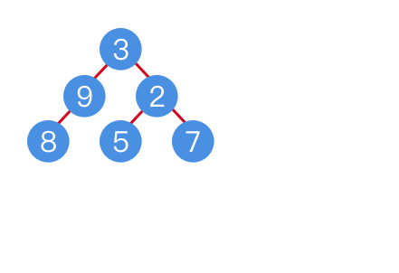

# 題目
Find the sum of all left leaves in a given binary tree.
 
算出所有左葉節點的加總。

Example:
``` swift

       3
      / \
     9  20
       /  \
      15   7

There are two left leaves in the binary tree, with values 9 and 15 respectively. Return 24.
```

這個二元樹有兩個左葉節點，分別為 9 和 15 ，加總為 24 。


# 解題

利用遞迴查找每一個左節點，如果該左節點無任何子節點 (左、右)，則判斷該左節點為葉節點。

將他的值加入答案中，如果還不是葉節點，就繼續往下找。



``` swift
func sumOfLeftLeaves(_ root: TreeNode?) -> Int {
    if root == nil { return 0 }
    var res = 0
    
    if root?.left != nil {
        if root?.left?.left == nil && root?.left?.right == nil {
            res += (root?.left?.val)!
        } else {
            res += sumOfLeftLeaves(root?.left)
        }
    }
    res += sumOfLeftLeaves(root?.right)
    return res
}
```