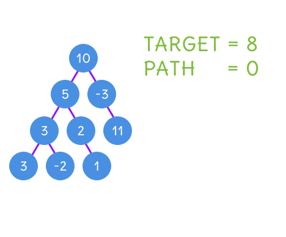

# 題目
You are given a binary tree in which each node contains an integer value.
 
Find the number of paths that sum to a given value.

The path does not need to start or end at the root or a leaf, but it must go downwards (traveling only from parent nodes to child nodes).

The tree has no more than 1,000 nodes and the values are in the range -1,000,000 to 1,000,000.

有一棵二元樹，每一個節點皆代表一整數。

找出有幾條路徑，加總值等於題目賦予的值。

路徑不用從根節點開始，也不需要再葉節點結束。但一定是從父節點一直往下移動。

整棵樹不會超過 1000 個節點，而且值會在 -1,000,000 到 1,000,000 之間。

---

# 範例
``` swift
root = [10,5,-3,3,2,null,11,3,-2,null,1], sum = 8

           10
          /  \
         5   -3
        / \    \
       3   2   11
      / \   \
     3  -2   1

Return 3. The paths that sum to 8 are:

1.  5 -> 3
2.  5 -> 2 -> 1
3. -3 -> 11
```

這棵樹共有 3 條路徑加總為 8 。
第一條 5 -> 3
第二條 5 -> 2 -> 1
第三條 -3 -> 11

---

# 解題

先寫出 findPath 函式，從確定好的頂點開始往下走，如果節點值與目標值相同，代表路徑多了一條。

每往下走目標值必須與當前的節點值相減，便於比對整條路的加總。

``` swift
func findPath(_ root: TreeNode?, _ sum: Int) -> Int {
    guard let root = root else { return 0 }
    var res = 0
    if root.val == sum { res += 1 }
    res += findPath(root.left, sum - root.val)
    res += findPath(root.right, sum - root.val)
    return res
}
```

由根節點開始，往下給每一個節點進行 findPath ，最終得出所有可能的路徑。

``` swift
func pathSum(_ root: TreeNode?, _ sum: Int) -> Int {
    guard let root = root else { return 0 }
    return findPath(root, sum) + pathSum(root.left, sum) + pathSum(root.right, sum)
}
```


