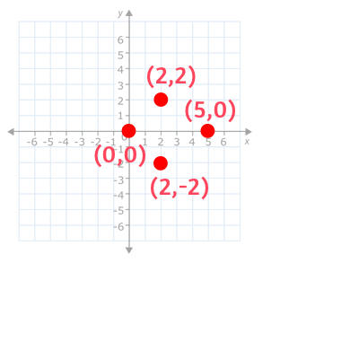

# 題目
Given n points in the plane that are all pairwise distinct, a "boomerang" is a tuple of points (i, j, k) such that the distance between i and j equals the distance between i and k (the order of the tuple matters).

Find the number of boomerangs. You may assume that n will be at most 500 and coordinates of points are all in the range [-10000, 10000] (inclusive).

在一個平面上給定 n 個點，每個點皆位於不同位置。 

一個迴力鏢代表一組點 (i, j, k) 他們三個的位置， i 到 j 的距離等於 i 到 k 的距離。

找出平面上的點，總共有多少個迴力鏢。

你可以假設平面上的點最多 500 個，並且座標皆介於範圍 [-10000, 10000] 間。

---

# 範例
``` swift
Input:
[[0,0],[1,0],[2,0]]

Output:
2

Explanation:
The two boomerangs are [[1,0],[0,0],[2,0]] and [[1,0],[2,0],[0,0]]
```

有點 (0,0), (1,0), (2,0) ，分別可以找到一個迴力鏢是 (1,0) , (0,0) , (2,0) ，
另一個是 (1,0) , (2,0) , (0,0) 。

---

# 解題

若有點 a, b, c 其中 a 與 b, c 距離相等。那就有兩種迴力鏢 bac , cab 。
若有點 a, b, c, d 其中 a 與 b, c, d 距離相等。那就有六種迴力鏢 bac, cab, bad, dab, cad, dac 。
也就是 a 有幾個相等距離的鄰點，就會有 `鄰點 * (鄰點 - 1)` 個迴力鏢。

所以用 dictionary 記錄每次的點有幾個鄰點的距離是相等的，
再算出相同距離情況下的鄰點，在公式 `鄰點 * (鄰點 - 1)` 下會有幾個迴力鏢。



``` swift
func numberOfBoomerangs(_ points: [[Int]]) -> Int {
    func getDistance(_ a: [Int], _ b: [Int]) -> Int {
        return (a[0] - b[0]) * (a[0] - b[0]) + (a[1] - b[1]) * (a[1] - b[1])
    }
    
    var map = [Int : Int]()
    var res = 0
    
    for i in 0..<points.count {
        for j in 0..<points.count {
            if i == j { continue }
            let distance = getDistance(points[i], points[j])
            map[distance] = (map[distance] ?? 0 ) + 1
        }
        
        for val in map.values {
            res += val * (val - 1)
        }
        
        map.removeAll()
    }
    return res
}
```

