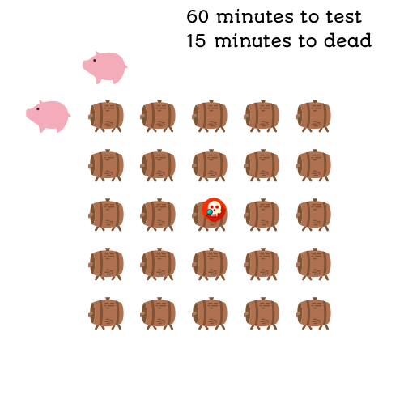

# 題目
There are 1000 buckets, one and only one of them contains poison, the rest are filled with water. They all look the same. If a pig drinks that poison it will die within 15 minutes. What is the minimum amount of pigs you need to figure out which bucket contains the poison within one hour.

有一千個桶子，只有一個桶子裝滿毒，其他的皆裝滿水。

如果一隻豬喝到毒，他會在 15 分鐘內死掉。

你需要用到最少幾隻豬來試出哪一個桶子有毒 ?

Answer this question, and write an algorithm for the follow-up general case.

回答問題，並且寫出接下來 follow-up 的演算法。

If there are n buckets and a pig drinking poison will die within m minutes, how many pigs (x) you need to figure out the "poison" bucket within p minutes? There is exact one bucket with poison.

如果有 n 個桶子，豬喝到毒會在 m 分鐘內死掉，請問需要幾隻豬 (x) 來找出毒桶子在 p 分鐘內 ?

# 解題

如果有 60 分鐘可以測 5 個桶子，喝到毒的豬會在 15 分鐘死掉，那只需要一隻豬即可。

喝一個桶子，等 15 分鐘，再喝一個，等 15 分鐘，直到喝完四個。如果沒死，代表第五個桶子有毒。

---

如果有 60 分鐘測 5x5 個桶子，一樣喝到毒會在 15 分鐘死掉，那這時只需兩隻豬。

一隻豬由左往右喝，一隻豬由上往下喝，喝完等待 15 分鐘，一樣做四次測驗，如果兩隻豬都沒有死掉，代表第二十五個桶子有毒。

---

如果有 60 分鐘測 5x5x5 個桶子，一樣喝到毒會在 15 分鐘死掉，那這時只需三隻豬。

一隻豬由左往右喝整層，一隻豬由上往下喝整層，一隻豬由前往後喝整層，喝完等待 15 分鐘，一樣做四次測驗，如果三隻豬都沒有死掉，代表第一百二十五個桶子有毒。



到這裡我們已經可以知道，如果有 n 桶水，可以測試 b 次 ( minutesToTest / minutesToDie + 1 )時，
只要跟豬的數量 x 平方，可以大於等於 n 就可以找出毒，也就是 `b^x >= n`。

``` swift
n = 1000, minutesToTest = 60, minutesToDie = 4, b = 60/4+1 = 5

5^x >= 1000

x = log5(1000) = 5
```

``` swift
import Foundation

func poorPigs(_ buckets: Int, _ minutesToDie: Int, _ minutesToTest: Int) -> Int {
    var pigs = 0.0
    while pow(Double(minutesToTest / minutesToDie + 1), pigs) < Double(buckets) {
        pigs += 1
    }
    return Int(pigs)
}
```