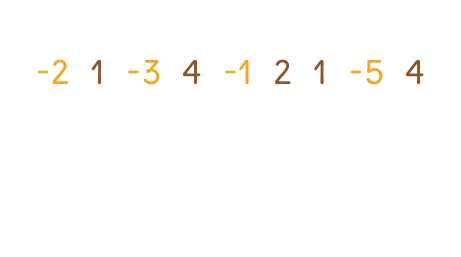

# 題目
Find the contiguous subarray within an array (containing at least one number) which has the largest sum.

找出陣列中，擁有最大值的子陣列，子陣列的值必須是連續且至少有一個值的。

---

# 範例
given the array [-2,1,-3,4,-1,2,1,-5,4],

the contiguous subarray [4,-1,2,1] has the largest sum = 6.

在陣列 [-2,1,-3,4,-1,2,1,-5,4] 中， [4,-1,2,1] 可以得到最大加總值 6 。

---

# 解題

題目要求出該陣列最大的子陣列。利用動態規劃，把題目拆成每一小段，如果每下一段加總大於前一小段，就將值累積起來。否則應該起始新的段落重新開始。




``` swift
func maxSubArray(_ nums: [Int]) -> Int {
    if nums.isEmpty { return 0 }
    var temp = nums[0], end = nums[0]
    for i in 1..<nums.count {
        temp = max(temp + nums[i], nums[i])
        end = max(temp, end)
    }
    return end
}
```


