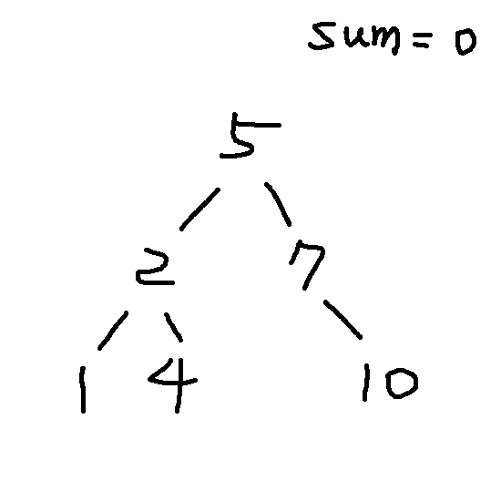

# 題目

Given a Binary Search Tree (BST), convert it to a Greater Tree such that every key of the original BST is changed to the original key plus sum of all keys greater than the original key in BST.

將二元搜索樹變為 Greater Tree ，將原本的節點值加上（其他節點值）的加總，其他節點的位置必須大於該節點。

Example:
 
``` swift
Input: The root of a Binary Search Tree like this:

       5
     /   \
    2     13

Output: The root of a Greater Tree like this:
      
       18
      /  \
    20    13
```

 2 -> 最小節點 -> 2 + 5 + 13 = 20
 5 -> 第二小節點 -> 5 + 13 = 18
 13 -> 沒有節點大於 13 -> 13

# 第一次解題 : 138 ms
從最大節點開始，計算加總值，輪到第二大節點時，將總值與該節點加起來成為新總值，不斷下去。

我做了一張 GIF 演示了一下流程 : 


``` swift
func convertBST(_ root: TreeNode?) -> TreeNode? {
    
    var sum = 0
    
    func convert(_ node: TreeNode?) {
        guard let node = node else { return }
        
        convert(node.right)
        
        node.val += sum
        sum = node.val
        
        convert(node.left)
    }
    
    convert(root)
    return root
}
```


