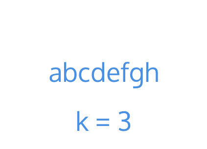

# 題目

Given a string and an integer k, you need to reverse the first k characters for every 2k characters counting from the start of the string. If there are less than k characters left, reverse all of them. If there are less than 2k but greater than or equal to k characters, then reverse the first k characters and left the other as original.
 
給予一個字串和一個整數 k ，你需要在每個 2k 就翻轉 k 個字元。

如果剩下的字元少於 k 個，就翻轉全部。

如果少於 2k 但是大於等於 k ，便翻轉 k 個字元，然後不動到剩下的字元。

Restrictions:
The string consists of lower English letters only.
Length of the given string and k will in the range [1, 10000]

> 注意:
字串只會包含英文字。
k 的範圍在 [1, 10000] 。


---

# 範例

``` swift
Input: s = "abcdefg", k = 2
Output: "bacdfeg"
```
s 有 7 個字元， k 為 2 。

所以需要翻轉 1, 2 個字元，跳過 2 個，再翻轉 5, 6 字元。

---

# 解題

將 String 變為 Array ，利用 stride 跳過 2k 的字元。

當遇到字元時，找出 i 到 j(i + k) 的字元，

j 可能會造成 Array Index Out Of Range ，所以 j 應該取 (i + k) 或 (s.count) 的最小值。

接著就對 i 到 j 實施 reverse 即可。



``` swift
func reverseStr(_ s: String, _ k: Int) -> String {
    
    var s = Array(s.characters)
    
    for i in stride(from: 0, to: s.count, by: 2*k){
        
        var i = i
        var j = min(i + k - 1, s.count - 1)
        
        while i < j {
            let temp = s[i]
            s[i] = s[j]
            s[j] = temp
            
            i += 1
            j -= 1
        }
    }
    return String(s)
}
```
