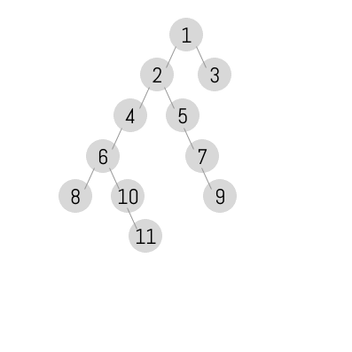

# 題目

Given a binary tree, you need to compute the length of the diameter of the tree. The diameter of a binary tree is the length of the longest path between any two nodes in a tree. This path may or may not pass through the root.
 
給定二元樹，計算出樹的直徑為多少。 

二元樹當中任意兩點的路徑若為最長，就代表該樹的直徑。

這條直徑有可能會經過根節點，有可能不會。

---

# 範例

Given a binary tree
``` swift
       1
      / \
     2   3
    / \
   4   5

Return 3, which is the length of the path [4,2,1,3] or [5,2,1,3].
```
直徑為 3 ，因為最長路徑為 [4,2,1,3] 或 [5,2,1,3] 。


Path does not pass root
``` swift
            1
           / \
          2   3
         / \
        4   5
       /     \
      6       7
     / \       \
    8   10      9
         \
         11

Return 7, which is the length of the path [11,10,6,4,2,5,7,9]
```
直徑為 7 ，因為最長路徑為 [11,10,6,4,2,5,7,9] 。

---

# 解題

每個節點的直徑，就等於左子樹的深度 + 右子樹的深度。



``` swift
func diameterOfBinaryTree(_ root: TreeNode?) -> Int {
    var res = 0
    var depth = 0
    
    func getDepth(root : TreeNode?) -> Int {
        if root == nil { return 0 }
        
        let left = getDepth(root: root?.left)
        let right = getDepth(root: root?.right)
        
        depth = max(depth, left + right)
        
        return max(left , right) + 1
    }
    
    getDepth(root: root)
    return depth
}
```


