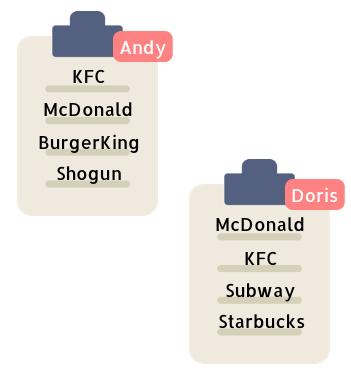

# 題目

Suppose Andy and Doris want to choose a restaurant for dinner, and they both have a list of favorite restaurants represented by strings.
 
You need to help them find out their common interest with the least list index sum. If there is a choice tie between answers, output all of them with no order requirement. You could assume there always exists an answer.

假設 Andy 和 Doris 想要找一間餐廳吃晚餐，他們兩個人都有一個喜愛的餐廳名單。

你的任務是幫他們兩個找到，第一個共同出現在名單上的餐廳。你可以假設 Andy 和 Doris 一定會有一間一樣喜歡的餐廳。

補充 : 如果皆是同時找到的餐廳，就把全部同時找到的餐廳列出來。

Example 1:
``` swift
Input:
["Shogun", "Tapioca Express", "Burger King", "KFC"]
["Piatti", "The Grill at Torrey Pines", "Hungry Hunter Steakhouse", "Shogun"]

Output: ["Shogun"]

Explanation: The only restaurant they both like is "Shogun".
```
他們兩個人的名單只有一間 Shogun 是共同喜歡的餐廳。


Example 2:
``` swift
Input:
["Shogun", "Tapioca Express", "Burger King", "KFC"]
["KFC", "Shogun", "Burger King"]

Output: ["Shogun"]

Explanation: The restaurant they both like and have the least index sum is "Shogun" with index sum 1 (0+1).
```
他們兩個人的名單有 Shogun 跟 KFC 是共同喜歡的餐廳。但是 Shogun 在兩個人的名單會先被共同找到。

---

# 解題

第一次錯誤發現如果有同時間的餐廳要一次列出來，結果我只列了一個。

接下來連續三次都 Time Limit Exceeded =0= LOLOLOL

多次失敗後終於 AC


---

首先將 Andy 的名單記錄到 dictionary [餐廳名: 找到的時間]。

接下來看 Doris 的名單，只要餐廳在剛剛紀錄的 ditionary 裡，就把該餐廳被 Andy 找到的時間，跟 Doris 找到現在這間餐廳的時間加在一起，作為最小值。

如果最小值出現新低，就更新最小值，並把答案陣列翻新。

如果最小值相同，就把餐廳加進答案陣列中。



``` swift
func findRestaurant(_ list1: [String], _ list2: [String]) -> [String] {
    var best = Int.max
    var dict1 = [String: Int]()
    var ans = [String]()
    
    for (i,v) in list1.enumerated() { dict1[v] = i }
    for (i,v) in list2.enumerated() {
        if let j = dict1[v] {
            if i + j < best {
                best = i + j
                ans = [v]
            } else if i + j == best {
                ans.append(v)
            }
        }
    }
    return ans
}

```


