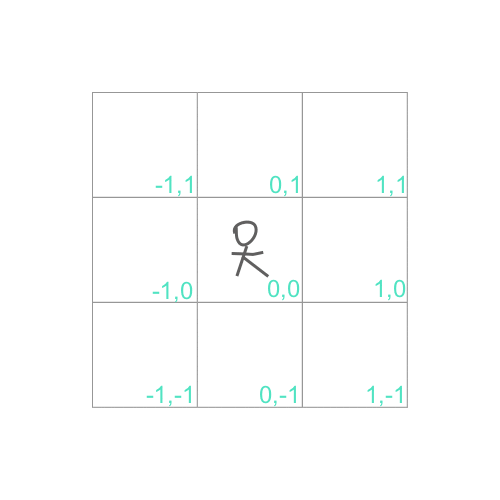

# 題目
Initially, there is a Robot at position (0, 0). Given a sequence of its moves, judge if this robot makes a circle, which means it moves back to the original place.

The move sequence is represented by a string. And each move is represent by a character. The valid robot moves are R (Right), L (Left), U (Up) and D (down). The output should be true or false representing whether the robot makes a circle.


有個機器人在座標 (0,0)， 給一個字串讓機器人動起來畫一個圓，意思就是他要走回原點。
字串中 R (Right), L (Left), U (Up) and D (down)，回傳 bool 判斷機器人是否回到原點。


Example 1:
``` swift
Input: "UD"
Output: true
```

Example 2:
``` swift
Input: "LL"
Output: false
```

# 第一次解題 : 428 ms

若要讓機器人回到原點，勢必往上走跟往下走的次數會相同，並且往左走跟往右走的次數也會相同。



用一個字典紀錄上下左右的次數，判斷 (上的次數 == 下的次數 && 左的次數 == 右的次數)

``` swift
func judgeCircle(_ moves: String) -> Bool {
    var dict = [Character: Int]()
    for s in Array(moves.characters) {
        dict[s] = (dict[s] ?? 0) + 1
    }
    return dict["U"] == dict["D"] && dict["R"] == dict["L"]
}
```


