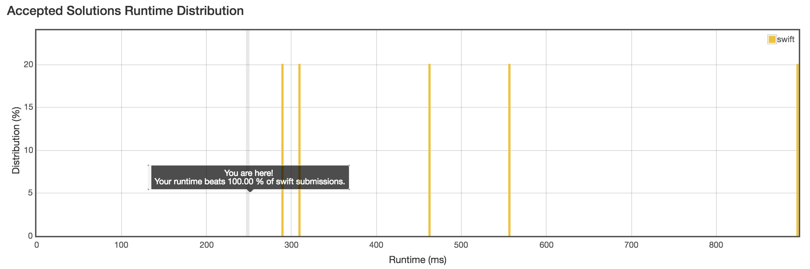

# 題目
Given a 2D integer matrix M representing the gray scale of an image, you need to design a smoother to make the gray scale of each cell becomes the average gray scale (rounding down) of all the 8 surrounding cells and itself. If a cell has less than 8 surrounding cells, then use as many as you can.
 
給一個二維矩陣，數字代表圖片的灰度，現在對圖片進行平滑處理，將每個像素轉換為周圍 9 個值的平均。


Example 1:
 
Input:
``` swift
[[1,1,1],
[1,0,1],
[1,1,1]]

Output:

[[0, 0, 0],
[0, 0, 0],
[0, 0, 0]]

Explanation:

For the point (0,0), (0,2), (2,0), (2,2): floor(3/4) = floor(0.75) = 0
For the point (0,1), (1,0), (1,2), (2,1): floor(5/6) = floor(0.83333333) = 0
For the point (1,1): floor(8/9) = floor(0.88888889) = 0
```

# 解題



先列出每個節點的位置，找出 9 宮格的範圍， min I ~ max I 與 min J ~ max J 。
算出該次節點的 9 宮格加總 / 次數，填入新陣列中。


``` swift
func imageSmoother(_ M: [[Int]]) -> [[Int]] {
    
    var matrix = M
    
    for i in 0..<matrix.count {
        for j in 0..<matrix[i].count {
            
            let mini = i == 0 ? 0 : i - 1
            let maxi = i == M.count - 1 ? M.count - 1 : i + 1
            
            let minj = j == 0 ? 0 : j - 1
            let maxj = j == matrix[i].count - 1 ? matrix[i].count - 1 : j + 1
            
            var sum = 0
            var cnt = 0
            
            for a in mini...maxi {
                for b in minj...maxj{
                    sum += M[a][b]
                    cnt += 1
                }
            }
            
            matrix[i][j] = (sum / cnt)
        }
    }
    
    return matrix
}
```


