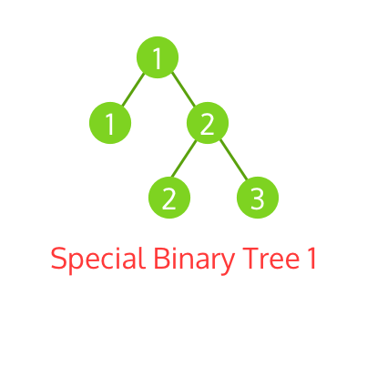

# 題目

Given a non-empty special binary tree consisting of nodes with the non-negative value, where each node in this tree has exactly two or zero sub-node. If the node has two sub-nodes, then this node's value is the smaller value among its two sub-nodes.

給一個特殊不為空的二元樹且不包含任何負數值，每個節點在這個樹中皆擁有「兩個」或「零個」子節點。

如果該節點有兩個子節點，那該節點的值會小於等於他的兩個子節點中間。

Given such a binary tree, you need to output the second minimum value in the set made of all the nodes' value in the whole tree.

這樣的二元樹，你需要從全部的節點找出，並輸出他的第二最小值。

If no such second minimum value exists, output -1 instead.

如果沒有第二最小值，輸出 -1 。

---

# 範例

Example 1:
``` swift
Input:
       2
      / \
     2   5
    / \
   5   7

Output: 5
Explanation: The smallest value is 2, the second smallest value is 5.
```
最小值是 2 ， 第二最小值是 5 。

Example 2:
``` swift
Input:
       2
      / \
     2   2

Output: -1
Explanation: The smallest value is 2, but there isn't any second smallest value.
```
最小值是 2 ， 但找不到第二最小值，所以輸出 -1 。

---

# 解題

因為每個節點的值會小於等於他的兩個子節點中間的關係，根節點一定會是最小的值，所以第二小的值絕對不會跟根節點相同數字。

知道這個後，用 DFS 找出每個節點不等於根節點的最小值就是答案。



``` swift
func findSecondMinimumValue(_ root: TreeNode?) -> Int {
    var res = -1
    var k = root?.val
    
    func dfs(_ node: TreeNode?) {
        guard let node = node else { return }
        
        if node.val != k {
            if res == -1 {
                res = node.val
            } else {
                res = min(res, node.val)
            }
        }
        dfs(node.left)
        dfs(node.right)
    }
    
    dfs(root)

    return res
}
```


